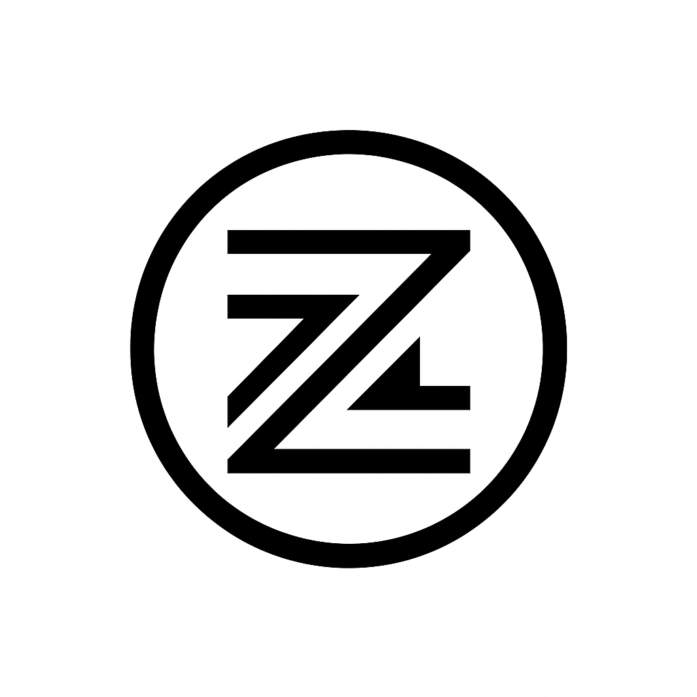
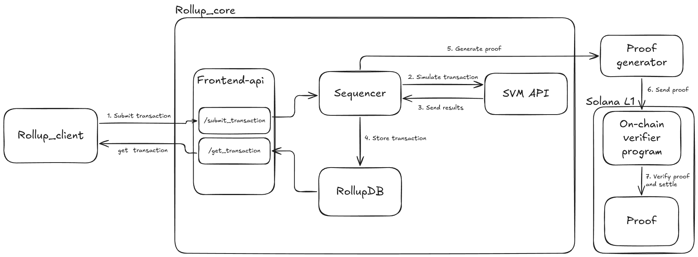

# ZKSVM Rollup

A general-purpose zero-knowledge rollup built on Solana's SVM (Solana Virtual Machine) for generating and verifying cryptographic proofs on-chain.

## Overview

ZKSVM is a research-oriented rollup implementation that leverages Solana's SVM API to create a scalable, proof-generating rollup system. The project focuses on benchmarking zero-knowledge proofs (SNARKs) on SVM as part of ongoing research into efficient blockchain scaling solutions.

## Architecture



The rollup consists of two main components:

### Rollup Core (`rollup_core/`)
The core rollup implementation that handles:
- **Sequencer**: Processes and batches transactions
- **RollupDB**: Manages account state and transaction storage
- **Frontend**: HTTP API for transaction submission and retrieval
- **Settlement**: Handles proof generation and on-chain verification

### Rollup Client (`rollup_client/`)
A client library for interacting with the rollup, providing:
- Transaction submission
- State querying
- Proof verification

## Tech Stack

### Core Dependencies
- **Solana SVM API**: `solana-svm = "2.0.7"`
- **Solana Runtime**: `solana-program-runtime = "2.0.7"`
- **Solana SDK**: `solana-sdk = "2.0.7"`
- **Solana Client**: `solana-client = "2.0.7"`
- **Compute Budget**: `solana-compute-budget = "2.0.7"`
- **BPF Loader**: `solana-bpf-loader-program = "2.0.7"`

### Web Framework
- **Actix Web**: High-performance async web framework
- **Tokio**: Async runtime for Rust

### Zero-Knowledge Integration
The project integrates with:
- **Light Protocol SVM**: For advanced zero-knowledge capabilities
- **Groth16-Solana**: For efficient SNARK proof generation
- **Ark-ff**: Prime field arithmetic for cryptographic operations
- **BN254**: Elliptic curve operations for pairing-based cryptography

```rust
use crate::errors::Groth16Error;
use ark_ff::PrimeField;
use num_bigint::BigUint;
use solana_bn254::prelude::{
    alt_bn128_addition, 
    alt_bn128_multiplication, 
    alt_bn128_pairing
};
```

## Why ZKSVM Rollup?

### Research Objectives
1. **SNARK Benchmarking**: Evaluate performance of zero-knowledge proofs on SVM
2. **Scalability Research**: Study efficient rollup architectures for blockchain scaling
3. **Proof Generation**: Develop optimized proof generation pipelines
4. **On-chain Verification**: Implement efficient on-chain proof verification

### Key Benefits
- **General Purpose**: Supports arbitrary Solana programs and transactions
- **SVM Native**: Leverages Solana's battle-tested virtual machine
- **Research Platform**: Designed for benchmarking and experimentation
- **Modular Architecture**: Separates concerns between core, client, and proof systems

## Getting Started

### Prerequisites
- Rust 1.70+ with Cargo
- Solana CLI tools
- Access to Solana devnet/mainnet

### Installation

1. Clone the repository:
```bash
git clone <repository-url>
cd zksvm
```

2. Build the rollup core:
```bash
cd rollup_core
cargo build --release
```

3. Build the rollup client:
```bash
cd ../rollup_client
cargo build --release
```

### Running the Rollup

1. Start the rollup core server:
```bash
cd rollup_core
cargo run --release
```

The server will start on `http://localhost:8080` with the following endpoints:
- `GET /`: Health check
- `POST /submit_transaction`: Submit a transaction to the rollup
- `POST /get_transaction`: Retrieve transaction status

2. Use the client to interact with the rollup:
```bash
cd rollup_client
cargo run --release
```

## API Endpoints

### Submit Transaction
```bash
curl -X POST http://localhost:8080/submit_transaction \
  -H "Content-Type: application/json" \
  -d '{
    "transaction": "base64_encoded_transaction"
  }'
```

### Get Transaction
```bash
curl -X POST http://localhost:8080/get_transaction \
  -H "Content-Type: application/json" \
  -d '{
    "signature": "transaction_signature"
  }'
```

## Development Status

### Completed Features
- ✅ Basic rollup architecture with sequencer
- ✅ Solana SVM integration
- ✅ Transaction processing pipeline
- ✅ HTTP API for transaction submission
- ✅ Account state management
- ✅ Crossbeam channels for async communication

### In Progress
- 🔄 Zero-knowledge proof generation
- 🔄 Groth16-Solana integration
- 🔄 On-chain proof verification
- 🔄 Performance benchmarking

### Planned Features
- 📋 Advanced proof batching
- 📋 Optimistic rollup support
- 📋 Cross-chain bridge integration
- 📋 Comprehensive benchmarking suite

## Research Goals

### SNARK Benchmarking on SVM
The primary research objective is to benchmark zero-knowledge proof generation and verification on Solana's SVM. This includes:

1. **Proof Generation Performance**: Measure time and resource usage for SNARK generation
2. **Verification Efficiency**: Optimize on-chain proof verification
3. **Scalability Analysis**: Study how proof generation scales with transaction volume
4. **Gas Cost Optimization**: Minimize on-chain verification costs

### Technical Challenges
- Integrating Groth16 proofs with Solana's BPF environment
- Optimizing elliptic curve operations on SVM
- Balancing proof generation time with verification efficiency
- Managing memory constraints in the Solana runtime

## Contributing

This is a research project focused on zero-knowledge rollup development. Contributions are welcome in the following areas:

- Zero-knowledge proof optimization
- SVM integration improvements
- Performance benchmarking
- Documentation and examples

## License

This project is licensed under the MIT License - see the [LICENSE](LICENSE) file for details.

## Acknowledgments

- Solana Labs for the SVM API
- Light Protocol for zero-knowledge research
- The broader zero-knowledge and rollup research community

---

**Note**: This is a research implementation and should not be used in production without thorough security audits and testing. 