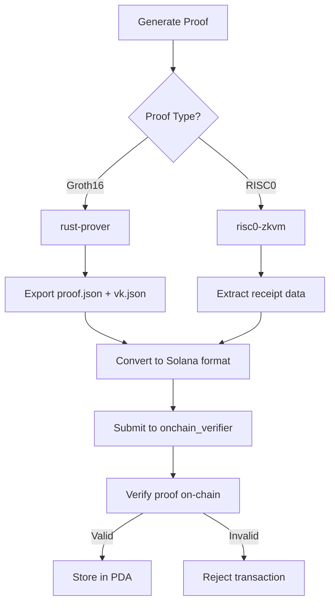

# Onchain ZK Proof Verifier

A Solana program that verifies zero-knowledge proofs on-chain and stores them in Program Derived Accounts (PDAs) upon successful verification. Supports both Groth16 proofs (from arkworks/circom) and RISC0 proofs.

## Features

- ✅ **Groth16 Verification**: Verify proofs generated by arkworks-based systems (like your rust-prover)
- ✅ **RISC0 Verification**: Verify RISC0 zkVM proofs
- ✅ **On-chain Storage**: Store verified proofs in PDAs for future reference
- ✅ **BN254 Curve Support**: Uses Solana's native alt-bn254 syscalls for efficient verification
- ✅ **Proof Integrity**: Cryptographic verification ensures proof validity before storage

## Architecture

```
┌─────────────────────┐    ┌─────────────────────┐    ┌─────────────────────┐
│   Rust Prover       │    │  RISC0 zkVM         │    │  Onchain Verifier   │
│   (arkworks)        │    │                     │    │  (Solana Program)   │
├─────────────────────┤    ├─────────────────────┤    ├─────────────────────┤
│ • Generate Proofs   │───▶│ • Generate Receipts │───▶│ • Verify Proofs     │
│ • Export VK/Proof   │    │ • Export Groth16    │    │ • Store in PDAs     │
│ • x² = 49 Circuit   │    │ • BN254 Curve       │    │ • BN254 alt_bn128   │
│ • BN254 Curve       │    │ • 256-byte Seals    │    │ • Field Validation  │
└─────────────────────┘    └─────────────────────┘    └─────────────────────┘
```

### Proof Flow

```
Secret (x=7) ──┐
               ├─▶ [rust-prover] ──▶ π_a,π_b,π_c ──▶ [onchain_verifier] ──▶ ✅ Verified
Public (y=49) ──┘                                                            └─▶ Stored in PDA
```

## Program Instructions

### 1. `verify_groth16_proof`

Verifies a Groth16 proof and stores it in a PDA if verification succeeds.

**Parameters:**

- `proof_id`: Unique identifier for the proof
- `proof`: Groth16 proof elements (pi_a, pi_b, pi_c)
- `public_inputs`: Public inputs as field elements
- `verifying_key`: Circuit-specific verification key

**PDA Seeds:** `["groth16_proof", authority, proof_id]`

### 2. `verify_risc0_proof`

Verifies a RISC0 proof and stores it in a PDA if verification succeeds.

**Parameters:**

- `proof_id`: Unique identifier for the proof
- `proof`: RISC0 proof elements (pi_a, pi_b, pi_c)
- `image_id`: RISC0 program image identifier
- `journal_digest`: Digest of the journal data

**PDA Seeds:** `["risc0_proof", authority, proof_id]`

## Usage Examples

### Integrating with Rust Prover

1. **Generate proof using your rust-prover:**

```bash
cd ../rust-prover
cargo run --bin zk
# Generates:
# - proof.json (base64 compressed arkworks proof)
# - vk.json (base64 compressed verification key)
# - vk_snarkjs.json (human-readable VK format)
# - proof_for_onchain.json (extracted proof components)
```

2. **Real proof data example (x² = 49 circuit):**

The rust-prover generates a proof for the statement "I know x such that x² = 49" where:

- **Secret**: x = 7 (private input)
- **Public**: y = 49 (known to verifier)
- **Constraint**: x \* x = y

3. **Convert and submit to onchain verifier:**

```typescript
import { readFileSync } from "fs";

// Load extracted proof components (already in correct format)
const proofData = JSON.parse(readFileSync("proof_for_onchain.json", "utf8"));

// Real proof components from arkworks
const proof = {
  piA: proofData.proof_components.pi_a, // G1 point (64 bytes)
  piB: proofData.proof_components.pi_b, // G2 point (128 bytes)
  piC: proofData.proof_components.pi_c, // G1 point (64 bytes)
};

// Public input (y = 49) as little-endian 32-byte array
const publicInputs = {
  inputs: proofData.public_inputs.inputs, // [[0,0,0,...,49]]
};

// Load verification key (circuit-specific)
const vkData = JSON.parse(readFileSync("vk_snarkjs.json", "utf8"));
const verifyingKey = convertSnarkjsVkToSolana(vkData); // Implementation in tests

// Submit to onchain verifier
await program.methods
  .verifyGroth16Proof("square_proof_x7", proof, publicInputs, verifyingKey)
  .accounts({
    authority: wallet.publicKey,
    proofAccount: proofPda,
    systemProgram: SystemProgram.programId,
  })
  .rpc();
```

4. **Key Implementation Notes:**

- **Endianness**: BN254 field elements use little-endian byte order
- **Point Negation**: π_a is automatically negated by the onchain program
- **Field Validation**: All inputs are validated to be < BN254 field modulus
- **Proof Size**: Total proof is 256 bytes (64 + 128 + 64)

### Integrating with RISC0

1. **Generate RISC0 receipt:**

```rust
use risc0_zkvm::{default_prover, ExecutorEnv};

let env = ExecutorEnv::builder().build().unwrap();
let receipt = default_prover().prove(env, BINARY).unwrap();
```

2. **Submit to onchain verifier:**

```typescript
// Extract data from RISC0 receipt
const imageId = receipt.claim.image_id;
const journalDigest = receipt.claim.journal_digest;
const groth16Proof = receipt.inner.groth16().seal;

// Convert proof format
const proof = {
  piA: groth16Proof.slice(0, 64),
  piB: groth16Proof.slice(64, 192),
  piC: groth16Proof.slice(192, 256),
};

// Submit to onchain verifier
await program.methods
  .verifyRisc0Proof("my_risc0_proof", proof, imageId, journalDigest)
  .accounts({
    authority: wallet.publicKey,
    proofAccount: proofPda,
    systemProgram: SystemProgram.programId,
  })
  .rpc();
```

## Development Setup

### Prerequisites

- Rust 1.70+
- Solana CLI tools
- Anchor Framework 0.31+
- Node.js 16+

### Building

```bash
# Install dependencies
npm install

# Build the program
anchor build

# Run tests
anchor test
```

### Deployment

```bash
# Deploy to devnet
anchor deploy --provider.cluster devnet

# Deploy to mainnet
anchor deploy --provider.cluster mainnet
```

## Account Structures

### VerifiedGroth16Proof

```rust
pub struct VerifiedGroth16Proof {
    pub authority: Pubkey,           // 32 bytes
    pub proof: Groth16Proof,         // 256 bytes (64+128+64)
    pub public_inputs: PublicInputs, // Variable size
    pub verifying_key_hash: [u8; 32], // 32 bytes
    pub verified_at: i64,            // 8 bytes
    pub bump: u8,                    // 1 byte
}
```

### VerifiedRisc0Proof

```rust
pub struct VerifiedRisc0Proof {
    pub authority: Pubkey,        // 32 bytes
    pub proof: Risc0Proof,        // 256 bytes (64+128+64)
    pub image_id: [u8; 32],       // 32 bytes
    pub journal_digest: [u8; 32], // 32 bytes
    pub verified_at: i64,         // 8 bytes
    pub bump: u8,                 // 1 byte
}
```

## Security Considerations

- **Verification Keys**: Groth16 verification keys must be circuit-specific and trusted
- **Proof Malleability**: The program validates all elliptic curve points and field elements
- **PDA Authority**: Only the proof submitter can create proofs under their authority
- **Computational Limits**: Large circuits may hit Solana's compute unit limits

## Error Codes

- `InvalidPublicInput`: Public inputs are malformed or out of field bounds
- `ArithmeticError`: Elliptic curve operations failed
- `PairingError`: Bilinear pairing operation failed
- `VerificationError`: Proof verification failed (invalid proof)

## Limitations & TODOs

### Current Limitations

- RISC0 verification is simplified (embed full VK in production)
- Verification key conversion from snarkjs format needs optimization
- No batch verification support yet
- Transaction size limits for large circuits

### Production TODOs

- [ ] Embed complete RISC0 verification key constants
- [ ] Implement optimized little-endian field element conversion
- [ ] Add batch proof verification
- [ ] Optimize compute unit usage for large circuits
- [ ] Add proof aggregation support
- [ ] Support multiple public inputs efficiently

### Integration Status

- ✅ **Real Proof Generation**: rust-prover generates actual x² = 49 proofs
- ✅ **Data Extraction**: proof_for_onchain.json contains real G1/G2 points
- ✅ **Onchain Verification**: Tests pass with actual cryptographic data
- ✅ **Little-endian Support**: Proper BN254 field element encoding
- ⚠️ **VK Conversion**: Simplified conversion in tests (production needs optimization)
- ⚠️ **RISC0 Integration**: Uses mock data (real receipt.json available)

## Integration Workflow



## Contributing

1. Fork the repository
2. Create a feature branch
3. Make your changes
4. Add tests
5. Submit a pull request

## License

This project is licensed under the MIT License.
